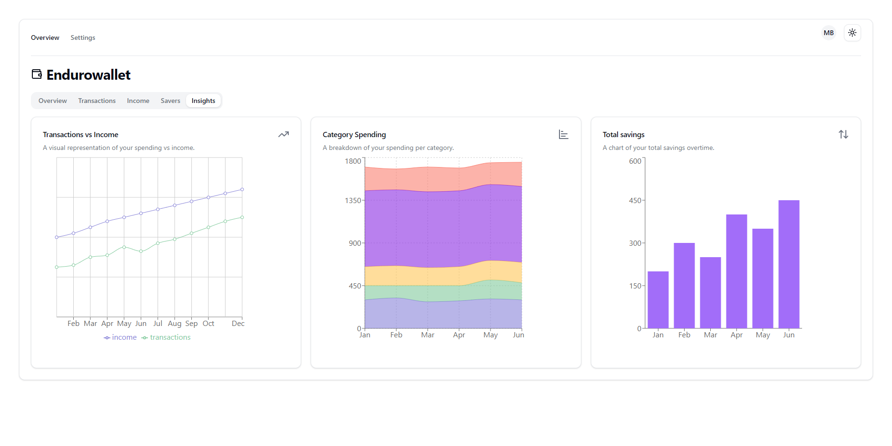

# EnduroWallet: Personal Finance Dashboard

For deployment instructions, please see the [Deployment Guide](DEPLOYMENT.md).

For a visual overview of our application, please refer to the [Screenshots Folder](SCREENSHOTS/).

For a demo account with info already added:

- Email: test@test.com
- Password: aaaaaa

Deployed URL:
- https://groupproject-439c2.web.app/

## Table of Contents

- [Overview](#overview)
  - [Key Objectives](#key-objectives)
  - [Target Users](#target-users)
  - [Data Sources](#data-sources)
- [MVP Implementation](#mvp-implementation)
- [Project Structure](#project-structure)
- [Future Directions](#future-directions)
- [Team Contributions](#team-contributions)
- [Collaboration and Communication](#collaboration-and-communication)

## Overview

In today's fast-paced world, managing personal finances has become a complex task, especially for individuals who are at the early stages of their career or academic journey. EnduroWallet is presented as a solution to this problem, offering a digital platform specifically tailored to make financial management straightforward and accessible.

Our vision is to create a user-friendly dashboard that provides transparent financial tracking and adaptable budgeting tools, catering to the unique needs of our target user group, which includes university students, recent graduates, part-time workers, interns, and young professionals.

### Key Objectives

- **Transparent Tracking:** Simplify financial tracking by allowing users to easily log and categorize their income and expenses, providing a clear overview of their financial health.

- **Adaptable Budgeting:** Offer flexible budgeting options that users can tailor to their individual financial goals, whether it's saving for a major purchase or planning for future expenses.

- **User-Focused Design:** Ensure the platform is intuitive and straightforward, making financial management accessible to users with varying degrees of financial literacy.

### Target Users

- University Students
- Recent Graduates
- Part-time Workers and Interns
- Young Professionals

### Data Sources

- User-Provided Data
- Predefined Categories

## MVP Implementation

Our MVP successfully integrates a robust backend using Firebase, incorporating cloud Firestore for data management and Firebase Authentication for user security. The front end includes a modern UI built with pre-styled Radix UI components, offering users a visually appealing and easy-to-navigate interface.

Implemented Features:

- Transactions/Income Breakdown: Allows users to track and categorize their financial activities effectively.
- Integration with Firebase Backend: Seamlessly connects the financial insights feature to our robust Firebase backend, ensuring real-time data synchronization and accurate financial analysis.
- Dashboard Overview: A consolidated view of the user's financial status, offering a quick and comprehensive understanding of their finances.

## Project Structure

- **src/contexts/AuthContext.jsx:** Provides user context across the application.
- **src/pages:** Contains the main pages of the website – Dashboard and SignIn.
- **src/elements/Dashboard:** Comprises all the elements/components that make up the dashboard.
- **src/elements/Dashboard/Tabs:** Hosts the content for each tab within the dashboard.

## Future Directions

Moving forward, we aim to enhance the user experience by:

- Introducing Google Sign-In functionality to provide users with a quick and secure way to sign up and log in using their Google accounts.
- Expanding the Firebase backend capabilities for improved data management.
- Introducing customisable dashboard options, allowing users to personalize the representation of their financial data.
- Fully figuring out the insights tab to provide meaningful and actionable financial insights, moving beyond sample data to offer users a comprehensive analysis of their financial health.

## Team Contributions

Our team collaborated through Discord and utilized the GitHub project board for task management.

- **Kobe and Emma:** Front-end development, crafting a user-friendly interface.
- **Tudor and Brent:** Focused on the backend, establishing a secure and scalable data management system.

## Collaboration and Communication

Throughout the project, our team maintained communication and collaboration, ensuring a coherent and cohesive development process. Regular meetings and updates via Discord, coupled with the strategic use of GitHub's project board, facilitated efficient project management.

---
